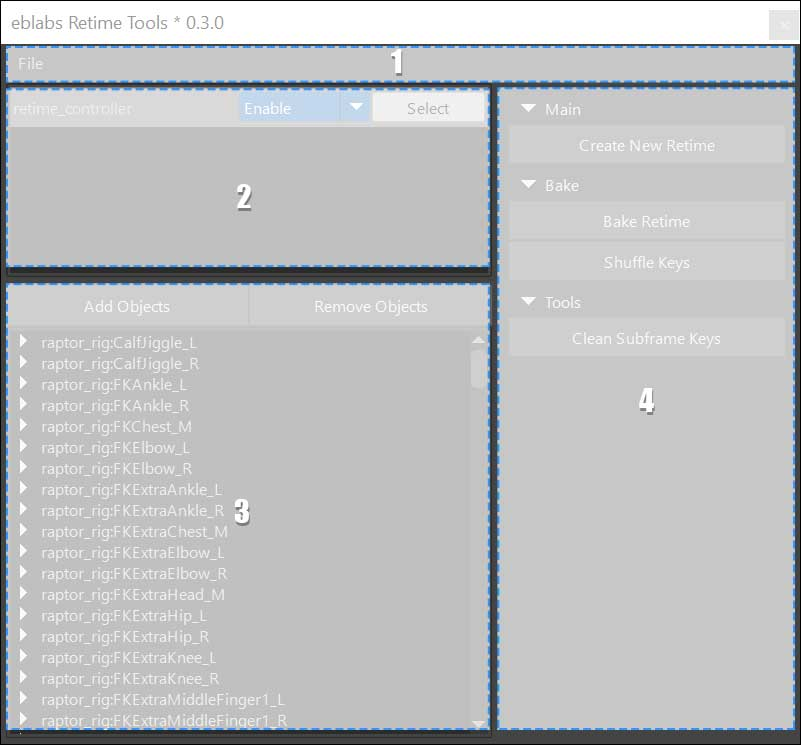
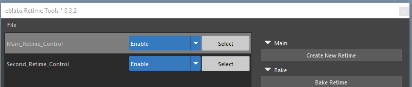

*note documentation is work in progress*

# Welcome to Retime Tools

A versitile toolset for retiming your animation. 

Some features include,
* Experiment with timing changes non-destructively.
* Any number of retimes in your scene.
* Full bake or "Shuffle" your existing keys based on the retime.


# How to install?
Use the Package Manager for quickly installing and updating tools, get it here:

[Package Manager Getting Started](https://eblabs.com/package-manager-quick-install-beta/)


# I want to...
## ...create a new Retime Control
## ...bake out my animation
## ...bake out my animation but perserve my keyframes
## ...clean up my subframe keys


# UI Manual

## Main Areas


| # | Area | Description | 
| --- | --- |--- |
| **1** | Menu Area | Here you can find various menus and options. |
| **2** | Retime Controls | Select and modify retime modes from here. |
| **3** | Objects List | Inspect and modify objects that are connected to the retime. |
| **4** | Tools Area | Various tools for working with Retimes. |

### Menu Area


### Retime Controls


| # | Area | 
| --- | --- |
| File Menu | Menu Area | 

### Objects List


### Tools Area


# Manual Installation (Advanced User)

The Package Manager makes installing a simple process, but if you need to do this manually here's how.

Tools should be installed to a common `eblabs_hub` folder. The `install path` should be one folder up from the `eblabs_hub` folder. Make sure that there are blank `__init__.py` files within all folders.

```python
install_path = 'E:/path/to/tools/folder/'
package_id = 'RetimeTools'

import os
import sys
if not install_path in sys.path:
    sys.path.append(install_path)

import eblabs_hub.RetimeTools.scripts.RetimeTools as tool
reload(tool)
w = tool.Window()
w.display()
```


