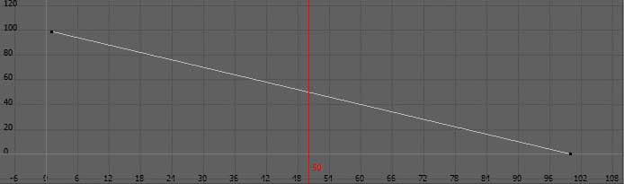

*note documentation is work in progress*

# Welcome to Retime Tools

A versitile toolset for retiming your animation. 

Some features include,
* Experiment with timing changes non-destructively.
* Any number of retimes in your scene.
* Full bake or "Shuffle" your existing keys based on the retime.


# How to install?
Use the Package Manager for quickly installing and updating tools, get it here:

[Package Manager Getting Started](https://eblabs.com/package-manager-quick-install-beta/)


# I want to...
## ...create a new Retime Control

> 

## ...bake out my animation

> 

## ...bake out my animation but perserve my keyframes

> 

## ...clean up my subframe keys

> 

## ...connect my objects, but its not working

> The Retime Control connects directly with Animation Curves, not objects, so be sure to make sure you have some animation keyed already.

## ...connect my animation layers, constraints, etc to the retime curve
> The retime tool does its best to find related animation based on the objects you are adding. This included Animation Layers and Constraints.

## ...connect image planes time attribute
> This works as well but you will need to remove the expression on the camera node frame attribute and replace it with keyframe animation that drives the frame. We are working on a solution where you wont need to do this eventually.

# Retime Curve Examples

## Default


* This is the default curve and your animation will appear unchanged. Resetting will go back to this.

## Speed Ramp


* In this example the animation begins slightly slower and then gets faster near the end. The start and end frames have stayed the same.

## Adjustment


* Here we are speeding up a small section in the middle. Since we are keeping the start and end frames the same, the beginning and end will slow down slightly.

## Loop


* Its possible to create loops or hard cuts in your retime by doing this.

## Reverse


* Here you can see the curve going in a reverse slow.
* You can even have your animation play forward and then in reverse all in the same retime animation.

# UI Manual

## Main Areas


| # | Area | Description | 
| --- | --- |--- |
| **1** | Menu Area | Here you can find various menus and options. |
| **2** | Retime Controls | Select and modify retime modes from here. |
| **3** | Objects List | Inspect and modify objects that are connected to the retime. |
| **4** | Tools Area | Various tools for working with Retimes. |

### Menu Area


| Item | Description | 
| --- | --- |
| Import/Export | **Coming Soon** Tools for import and exporting the Retime animation as json so it can be shared with other artists and departments.  | 

### Retime Controls


| Item | Description | 
| --- | --- |
| Controls | Here you will see a list of Retime Controls in your scene. Click on a control to display its connections in the Object List.  | 
| Actions Dropdown **Reset** | This resets the Retime Control, removing any changes you have made to the retime curve. |
| Actions Dropdown **Enable** | This enables the Retime Control. |
| Actions Dropdown **Disable** | This temporarily disables the Retime Control, while staying connected to all of the objects you've added. |
| Actions Dropdown **Invert** | This "Inverts" the retime curve. This is helpful if you'd like to Un-Retime animation based on a specific Retime curve. |
| Actions Dropdown **Disconnect** | This safely removes all objects that are controlled by the Retime Control. |
| Actions Dropdown **Delete** | This removes the Retime Control from your maya scene. |
| Select Button | This will select the Retime Control in your maya scene so you can modify the retime animation. |

### Objects List


| Item | Description | 
| --- | --- |
| Objects | Clicking on a Retime Control above will update the list of objects. Clicking on anything in this list will also select the objects in your Maya scene.| 
| Expand | Navigate the tree view to see what objects, channels and animation curves are connected.  | 
| Add Objects | Select objects in your scene that have animation and click here. This will connect Animation Curves related to your selection to the Retime Control. | 
| Remove | Removes the selected items from the list, from the Retime Control.  | 

### Tools Area


| Item | Description | 
| --- | --- |
| Create New Retime | This will make a new Retime Control in your scene. Feel free to rename these and have as many as you like.| 
| Bake Retime | This will bake out the retime for the duration of the Retime Control animation.  | 
| Shuffle Keys | This will shift around the timing of your existing animation keys based on the Retime Control animation. This is the most animation friendly way to make timing changed to your animation. | 
| Clean Subframe Keys | Optional for Shuffle Keys, as well as its own button. If you are shuffling keys its very likely individual animation keys become shifted to sub frames. This tool is a way to clean up these keys by removing duplicates and repositioning keys to whole frames while preserving the animation as best as possible. This is a much better option than using Maya's Snap Keys tool.  | 


# Manual Installation (Advanced User)

The Package Manager makes installing a simple process, but if you need to do this manually here's how.

Tools should be installed to a common `eblabs_hub` folder. The `install path` should be one folder up from the `eblabs_hub` folder. Make sure that there are blank `__init__.py` files within all folders.

```python
install_path = 'E:/path/to/tools/folder/'
package_id = 'RetimeTools'

import os
import sys
if not install_path in sys.path:
    sys.path.append(install_path)

import eblabs_hub.RetimeTools.scripts.RetimeTools as tool
reload(tool)
w = tool.Window()
w.display()
```


